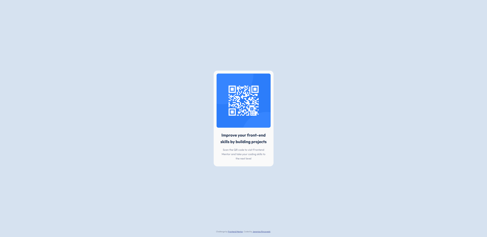

# Frontend Mentor - QR code component solution

This is a solution to the [QR code component challenge on Frontend Mentor](https://www.frontendmentor.io/challenges/qr-code-component-iux_sIO_H). Frontend Mentor challenges help you improve your coding skills by building realistic projects. 

## Sumario

- [resumo](#resumo)
  - [Screenshot](#screenshot)
  - [Links](#links)

## resumo

Um projeto usando HTML e CSS puro, a ideia dele é fazer um leitor de QR Code, meu objetivo principal ao fazer esse projeto é tentar chegar a um resultado mais perto o possivel do pedido pelo projeto alem de treinar habilidades basicas como HTML e CSS

### Screenshot

### Links

- Solution URL: [Add solution URL here](https://www.frontendmentor.io/solutions/html-css-eEn0omjy52)
- Live Site URL: [site do Qr Code](https://jeremiasrincaveski.github.io/QR-code-component/)